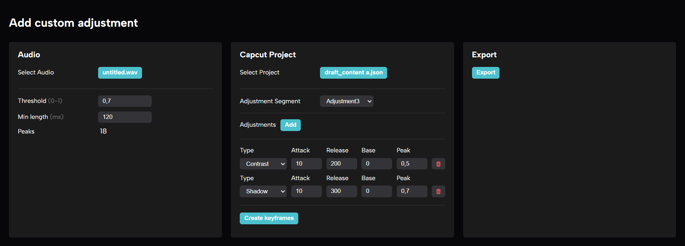

# Capcut Audio Peaks to Keyframes

Tested on CapCut 2.9.0 Windows app

### Instructions

- **CAPCUT**:
  - Create a CapCut project and add a custom adjustment track.
  - **Important**: Close the project.
  - Create a backup of the project file (`draft_content.json`).
    - C:\Users\\*Username*\AppData\Local\CapCut Drafts\\*Project Name*
- **THIS APP**:
  - Load the audio track that will trigger the keyframes.
  - Adjust the threshold and min length to detect the correct number of peaks.
  - Load the CapCut project
  - Select the adjustment track to add keyframes to.
  - Add an adjustment.
  - Adjust the attack, release, base, and peak values.
  - Press "Create keyframes" button.
  - Save the project using the "Export" button (replace the original file).
- **CAPCUT**:
  - Open the project.
  - You should see the keyframes in the adjustment track.
  - **Important**: If you see them but they don't work, select one of the keyframes and move the slider a bit: all the keyframes should work now.
